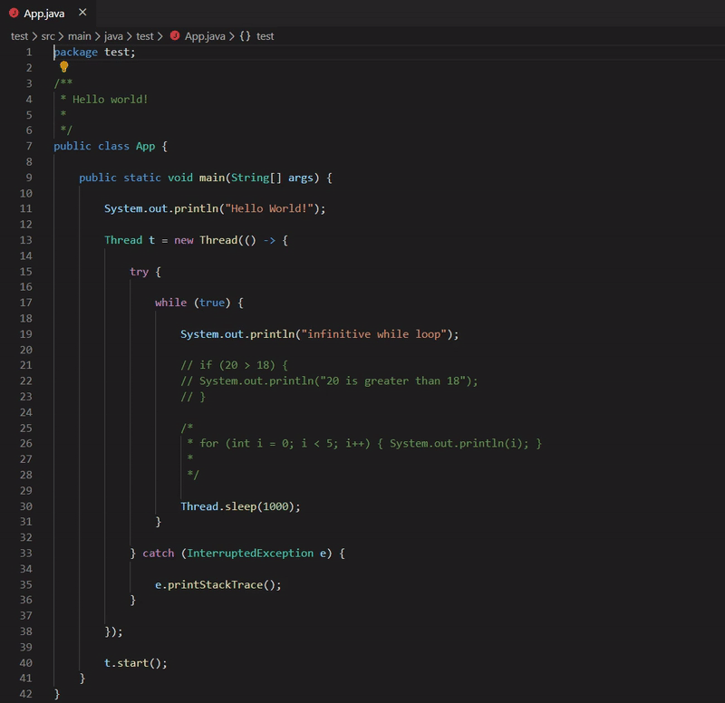

<svg width="100" height="100" xmlns="http://www.w3.org/2000/svg">
<foreignObject width="100" height="100">
    <div xmlns="http://www.w3.org/1999/xhtml">
        <ul>
            <li>text</li>
        </ul>
        <iframe src="https://docs.google.com/spreadsheets/d/e/2PACX-1vQUlkygeTijWHY0q7dDa5mxjWSYCOObAPPdXBpNPcE4pSC9twVQTFYBgOlflmSCoUZF4T6Ral-OZ8Qe/pubhtml?gid=0&amp;single=true&amp;widget=true&amp;headers=false"></iframe>
    </div>
</foreignObject>
</svg>


# Blockscope-Highlighter

The Blockscope-Highlighter extension will highlight the area where the current block scope is delimited by defined brackets.<br />
The goal is to increase readability and visualisation during development in different popular languages.<br />

## Features

- **highlight only the active scope selection and ignore comments**



## Extension Settings

- `blockscope-highlighter.bracket`: Brackets which are used to delimit the scope selection.

```
    "blockscope-highlighter.bracket": {
        "start": "{",
        "end": "}"
    }
```

- `blockscope-highlighter.rgba`: RGBA which are used to color the scope selection.

```
    "blockscope-highlighter.rgba": {
        "red": 0,
        "green": 100,
        "blue": 150,
        "alpha": 0.1
    }
```

- `blockscope-highlighter.syntax`: Syntax wich are used to define comment for the identifier of the language associated with this document..

```
    "blockscope-highlighter.syntax": [
        {
            "languageId": [
            "asciidoc"
            ],
            "singleline": "//",
            "multilineStart": "////",
            "multilineEnd": "////"
        },
        {
            "languageId": [
            "apex",
            "javascript",
            "javascriptreact",
            "typescript",
            "typescriptreact",
            "al",
            "c",
            "cpp",
            "csharp",
            "dart",
            "flax",
            "fsharp",
            "go",
            "groovy",
            "haxe",
            "java",
            "jsonc",
            "kotlin",
            "less",
            "pascal",
            "objectpascal",
            "php",
            "rust",
            "scala",
            "scss",
            "stylus",
            "swift",
            "verilog",
            "vue"
            ],
            "singleline": "//",
            "multilineStart": "/*",
            "multilineEnd": "*/"
        },
        {
            "languageId": [
            "css"
            ],
            "singleline": "/*",
            "multilineStart": "/*",
            "multilineEnd": "*/"
        },
        {
            "languageId": [
            "coffeescript",
            "dockerfile",
            "gdscript",
            "graphql",
            "julia",
            "makefile",
            "perl",
            "perl6",
            "puppet",
            "r",
            "ruby",
            "shellscript",
            "tcl",
            "yaml",
            "tcl"
            ],
            "singleline": "#"
        },
        {
            "languageId": [
            "elixir",
            "python"
            ],
            "singleline": "#",
            "multilineStart": '"""',
            "multilineEnd": '"""'
        },
        {
            "languageId": [
            "nim"
            ],
            "singleline": "#",
            "multilineStart": "#[",
            "multilineEnd": "]#"
        },
        {
            "languageId": [
            "powershell"
            ],
            "singleline": "#",
            "multilineStart": "<#",
            "multilineEnd": "#>"
        },
        {
            "languageId": [
            "ada",
            "hive-sql",
            "pig",
            "plsql",
            "sql"
            ],
            "singleline": "--"
        },
        {
            "languageId": [
            "lua"
            ],
            "singleline": "--",
            "multilineStart": "--[[",
            "multilineEnd": "]]"
        },
        {
            "languageId": [
            "elm",
            "haskell"
            ],
            "singleline": "--",
            "multilineStart": "{-",
            "multilineEnd": "-}"
        },
        {
            "languageId": [
            "vb",
            "diagram"
            ],
            "singleline": "'"
        },
        {
            "languageId": [
            "bibtex",
            "erlang",
            "latex",
            "matlab"
            ],
            "singleline": "%"
        },
        {
            "languageId": [
            "clojure",
            "racket",
            "lisp"
            ],
            "singleline": ";"
        },
        {
            "languageId": [
            "terraform"
            ],
            "singleline": "#",
            "multilineStart": "/*",
            "multilineEnd": "*/"
        },
        {
            "languageId": [
            "COBOL"
            ],
            "singleline": "*>"
        },
        {
            "languageId": [
            "fortran-modern"
            ],
            "singleline": "c"
        },
        {
            "languageId": [
            "SAS",
            "stata"
            ],
            "singleline": "*",
            "multilineStart": "/*",
            "multilineEnd": "*/"
        },
        {
            "languageId": [
            "html",
            "markdown"
            ],
            "singleline": "<!--",
            "multilineStart": "<!--",
            "multilineEnd": "-->"
        },
        {
            "languageId": [
            "twig"
            ],
            "singleline": "{#",
            "multilineStart": "{#",
            "multilineEnd": "#}"
        },
        {
            "languageId": [
            "genstat"
            ],
            "singleline": "\\",
            "multilineStart": '"',
            "multilineEnd": '"'
        },
        {
            "languageId": [
            "cfml"
            ],
            "singleline": "<!---",
            "multilineStart": "<!---",
            "multilineEnd": "--->"
        }
    ]
```
